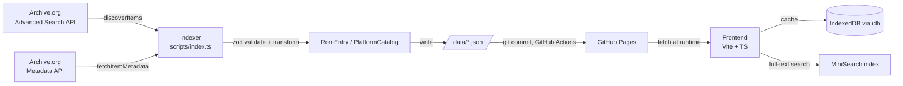

# Architecture

## Data flow

**Boundary rule**: raw Archive.org shapes (`src/types/archive-org.ts`) never cross
into the frontend or into `/data/*.json`. The indexer is the only module allowed
to import `archive-org.ts`; everything downstream consumes `src/types/rom.ts`
only. This keeps the frontend schema stable even if Archive.org's API shape
changes.

## Module boundaries

| Module | Responsibility | Allowed imports |
|---|---|---|
| `scripts/` | Discovery, extraction, transformation, JSON output | `src/types/*`, `src/config/*`, `src/utils/*` (Node-safe only) |
| `src/types/archive-org.ts` | External API shapes + validation | `zod` only |
| `src/types/rom.ts` | Internal canonical schema + validation | `zod` only |
| `src/config/platforms.config.ts` | Platform → Archive.org collection mapping | `zod`, `src/types/rom.ts` (schema types only) |
| `src/` (frontend) | UI, search, cache | `src/types/rom.ts`, `src/config/*`, browser APIs |
| `data/` | Generated output, never hand-edited | — |

`src/utils/id.ts` uses `node:crypto` and is therefore indexer-only; it must
not be imported from frontend code (enforced by code review until an
ESLint `no-restricted-imports` rule is added in Phase 2).

## Frontend framework decision

**Decision: Vite + TypeScript, framework choice deferred to start of Phase 4.**

| Option | Pros | Cons |
|---|---|---|
| Vanilla TS + Vite | Zero framework overhead, smallest bundle, full control over DOM updates | More boilerplate for reactive filter/search state |
| Svelte + Vite | Compiles away, small runtime, ergonomic reactivity for filters/pagination | Extra build step, team must learn Svelte syntax |

Both compile through the same `src/tsconfig.json` and Vite pipeline defined
in Phase 1, so the decision does not block Phase 1–3 work. Re-evaluate at
the start of Phase 4 based on team familiarity; lean Svelte if reactive
filter state (multi-criteria search + pagination) proves verbose in vanilla TS.

## Legal / compliance notes

- Respect Archive.org's [Terms of Use](https://archive.org/about/terms.php):
  the indexer must send a descriptive `User-Agent` header identifying the
  project and a contact point, and must not bypass documented rate limits.
- Concurrency and delay are centrally configured (`MAX_CONCURRENT_REQUESTS`,
  `REQUEST_DELAY_MS`, Phase 2.1) so throttling is a one-line config change,
  not a code change.
- Every `downloadUrl` in `RomEntry` points directly to the file on
  `archive.org` — this project mirrors no binary content itself; only
  metadata is stored in `/data/*.json`.
- Attribution: each platform page should credit Archive.org and link back
  to the source item (`archiveIdentifier`) per its terms.

## Schema versioning

`CURRENT_SCHEMA_VERSION` (in `src/types/rom.ts`) is embedded in every
`PlatformCatalog` and in `SearchIndexManifest`. The frontend compares this
value against its own compiled-in expectation before rendering; on
mismatch it shows an "outdated data, please refresh" state instead of
attempting to read fields that may no longer exist. Bump the constant and
add a short migration note here whenever `RomEntry` or `PlatformCatalog`
changes shape.
