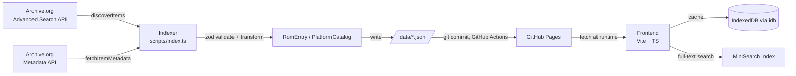

# Architecture

## Data flow

**Boundary rule**: raw Archive.org shapes (`src/types/archive-org.ts`) never cross
into the frontend or into `/data/*.json`. The indexer is the only module allowed
to import `archive-org.ts`; everything downstream consumes `src/types/rom.ts`
only. This keeps the frontend schema stable even if Archive.org's API shape
changes.

## Module boundaries

| Module                           | Responsibility                                         | Allowed imports                                               |
| -------------------------------- | ------------------------------------------------------ | ------------------------------------------------------------- |
| `scripts/`                       | Discovery, extraction, transformation, JSON output     | `src/types/*`, `src/config/*`, `src/utils/*` (Node-safe only) |
| `src/types/archive-org.ts`       | External API shapes + validation                       | `zod` only                                                    |
| `src/types/rom.ts`               | Internal canonical schema + validation                 | `zod` only                                                    |
| `src/config/platforms.config.ts` | Platform → Archive.org collection mapping              | `zod`, `src/types/rom.ts` (schema types only)                 |
| `src/app/`                       | Svelte UI, data loaders, search index, app-level types | `src/types/rom.ts`, `src/config/*`, browser APIs              |
| `data/`                          | Generated output, never hand-edited                    | —                                                             |

`src/utils/id.ts` uses `node:crypto` and is indexer-only; it is excluded
from `src/tsconfig.json`'s `include`, so importing it from frontend code
fails the frontend typecheck.

The frontend fetches catalogs at `{BASE_URL}data/{platform}.json` and the
manifest at `{BASE_URL}data/manifest.json`, where `BASE_URL` is Vite's
`import.meta.env.BASE_URL` (`/GamesRoms/` in production, matching the
GitHub Pages project path). In dev, `vite.config.ts` registers a middleware
that serves the repository's `data/` directory under that path so the same
fetch calls work identically in `vite dev` and in the built site. In CI,
`.github/workflows/deploy.yml` runs `npm run build` then copies `data/` into
`dist/data/` before publishing to Pages.

## Frontend framework decision

**Decision (Phase 4): Vite + TypeScript + Svelte 5.**

| Option            | Pros                                                                      | Cons                                              |
| ----------------- | ------------------------------------------------------------------------- | ------------------------------------------------- |
| Vanilla TS + Vite | Zero framework overhead, smallest bundle, full control over DOM updates   | More boilerplate for reactive filter/search state |
| Svelte + Vite     | Compiles away, small runtime, ergonomic reactivity for filters/pagination | Extra build step, team must learn Svelte syntax   |

Svelte was chosen for its ergonomic reactivity (`$state`/`$derived`/`$effect`
runes) across the multi-criteria search, filter, and lazy-loading state in
Phase 4. Frontend source lives under `src/app/` (components, data loaders,
search index, app-level types) and imports the shared `src/types`,
`src/config`, and `src/utils` modules directly — it does not duplicate them.
`svelte-check` (wired into `npm run typecheck`) type-checks `.svelte` files
against `src/tsconfig.json`; ESLint lints them via `svelte-eslint-parser`.

## Legal / compliance notes

- Respect Archive.org's [Terms of Use](https://archive.org/about/terms.php):
  the indexer must send a descriptive `User-Agent` header identifying the
  project and a contact point, and must not bypass documented rate limits.
- Concurrency and delay are centrally configured (`MAX_CONCURRENT_REQUESTS`,
  `REQUEST_DELAY_MS`, Phase 2.1) so throttling is a one-line config change,
  not a code change.
- Every `downloadUrl` in `RomEntry` points directly to the file on
  `archive.org` — this project mirrors no binary content itself; only
  metadata is stored in `/data/*.json`.
- Attribution: each platform page should credit Archive.org and link back
  to the source item (`archiveIdentifier`) per its terms.

## Schema versioning

`CURRENT_SCHEMA_VERSION` (in `src/types/rom.ts`) is embedded in every
`PlatformCatalog` and in `SearchIndexManifest`. The frontend compares this
value against its own compiled-in expectation before rendering; on
mismatch it shows an "outdated data, please refresh" state instead of
attempting to read fields that may no longer exist. Bump the constant and
add a short migration note here whenever `RomEntry` or `PlatformCatalog`
changes shape.
