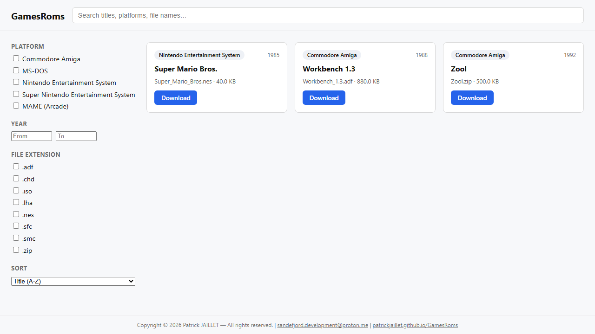

# AmigaRoms

Static Commodore Amiga ROM catalog and search engine indexing Archive.org collections, deployed on GitHub Pages.

## Screenshot

_UI preview with sample entries — the live catalog data is populated by the indexer._

## Stack

TypeScript (strict), Node.js, zod, Vite, Svelte 5, MiniSearch, idb, GitHub Actions.

## Getting started

See [COMPILATION.md](COMPILATION.md) for installation, type checking, linting, testing, and build instructions.

## Attribution

This project indexes metadata only; every download link points directly to the source file on [archive.org](https://archive.org). Each catalog entry credits Archive.org and links back to its source item.

## License

Copyright © 2026 Patrick JAILLET — All rights reserved.
Email: sandefjord.development@proton.me
Website: https://patrickjaillet.github.io/AmigaRoms
